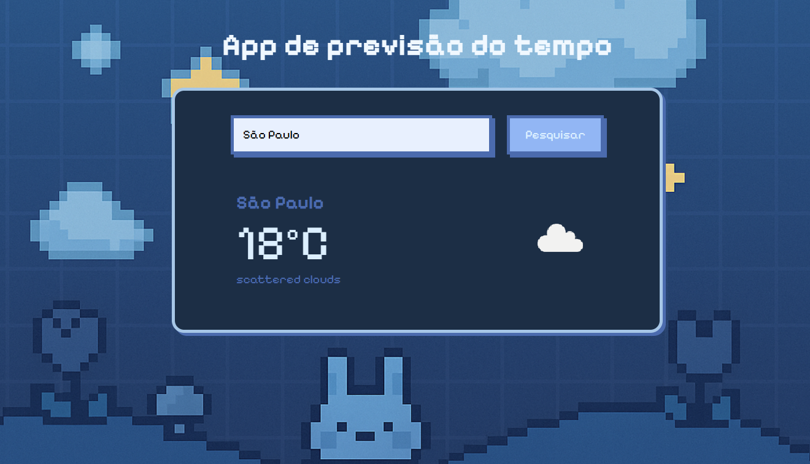

# ⛅ Weather Pixel — App de Clima

Um aplicativo de clima feito com TypeScript, estilizado com pixel art e alimentado pela API do OpenWeatherMap. Desenvolvido como projeto de aprendizado para praticar consumo de APIs, manipulação de DOM, e estilização criativa com CSS.

 <!-- opcional: imagem de preview do app -->

---

## 🚀 Funcionalidades

- 🔍 Busca de clima por cidade
- 🌡️ Exibição da temperatura atual
- 🗣️ Descrição do clima
- 💅 Estilização com CSS moderno e `image-rendering: pixelated`
- 🧠 Código organizado com TypeScript

---

## 🛠️ Tecnologias utilizadas

- [TypeScript](https://www.typescriptlang.org/)
- [HTML5](https://developer.mozilla.org/pt-BR/docs/Web/HTML)
- [CSS3](https://developer.mozilla.org/pt-BR/docs/Web/CSS)
- [OpenWeatherMap API](https://openweathermap.org/api)

---

## 📦 Como rodar o projeto

1. Clone o repositório:
   ```bash
   git clone https://github.com/seu-usuario/weather-pixel.git 
   ```
2. Instale uma extensão de servidor local (como Live Server no VSCode) ou abra o index.html diretamente no navegador.

 - Crie uma conta no OpenWeatherMap e gere sua chave de API.

 - Substitua a chave no código:
```bash
ts
const response = await fetch(`https://api.openweathermap.org/data/2.5/weather?q=${location}&appid=SUA_CHAVE&units=metric`);
```

## 📚 O que eu aprendi
- Como consumir APIs com fetch e async/await
- Como manipular o DOM com TypeScript
- Como usar variáveis CSS e organizar estilos
- Como aplicar image-rendering: pixelated para criar um visual retrô
- Como trabalhar com condições climáticas e lógica condicional

## ✨ Próximos passos
- [ ] Adicionar previsão para os próximos dias
- [ ] Salvar cidades favoritas com localStorage
- [ ] Adicionar modo noturno com pixel art temática

## 📸 Créditos
API: OpenWeatherMap
Ícones em pixel art: criados manualmente e gerados com IA
Feito com 💜 por Fernanda